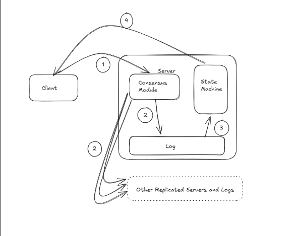

# Raft Consensus Algorithm

A from-scratch implementation of the Raft distributed consensus algorithm in Python, with a live visualization frontend.

Built as a learning project to understand how distributed systems maintain consistency across multiple nodes, even when nodes crash or network messages get lost.

---

## What is Raft?

Raft is a consensus algorithm , a way to get a cluster of servers to agree on a shared state (like a key-value store) even in the face of failures. It was designed to be easier to understand than Paxos, and it works by electing a single leader who coordinates all writes.

If the leader crashes, the remaining nodes automatically elect a new one. Clients can write to any node, followers redirect to the leader automatically.

---

## Deep dive — how Raft actually works

There are two lenses to see through the Raft algorithm: one from an algorithmic point of view and another from a distributed systems perspective.

Raft is a **consensus algorithm** for managing a **replicated log**. Consensus algorithms typically arise in the context of replicated state machines. A state machine is a machine running on a server that responds to external stimuli like a client. By extension, replicated state machines are multiple copies of that machine running on different servers, all processing the same sequence of inputs to produce the same sequence of outputs and state, making them deterministic. These machines are typically implemented using a replicated log: each server stores a log containing a series of commands which its state machine executes in order. Keeping that log consistent is the job of the consensus algorithm, it allows a collection of machines to work as a coherent group that can survive the failures of some of its members.

Here's an architecture of Raft.


Raft was designed as an alternative to Leslie Lamport's Paxos protocol. It decomposes the consensus problem into three relatively independent subproblems:

1. **Leader election** — a new leader must be chosen when an existing leader fails
2. **Log replication** — the leader accepts log entries from clients and replicates them across the cluster, forcing the other logs to agree with its own
3. **Safety** — if any server has applied a particular log entry to its state machine, no other server may apply a different command for that same index

### Leader election

Raft uses a heartbeat mechanism to trigger leader election. When servers start up, they begin as followers. A server remains a follower as long as it receives valid RPCs from a leader or candidate. Raft uses two types of RPCs: `RequestVote`, initiated by candidates during elections, and `AppendEntries`, initiated by the leader to replicate log entries and send periodic heartbeats.

If a follower receives no heartbeat over a period called the **election timeout**, it assumes there is no leader and begins an election. Raft divides time into **terms** of arbitrary length, each term begins with an election. To start one, a follower increments its term, transitions to candidate, votes for itself, and sends `RequestVote` RPCs to all other servers.

A candidate wins if it receives votes from a majority. Votes are given on a first-come-first-served basis, each server votes for at most one candidate per term. Once elected, the leader immediately sends heartbeats to establish authority and prevent new elections.

If a candidate receives an `AppendEntries` RPC from a server claiming to be leader: if the leader's term is at least as large as the candidate's, it recognizes the leader as legitimate and steps down to follower. If the term is smaller, it rejects the RPC and continues as candidate.

Split votes can occur when multiple followers become candidates simultaneously. Raft handles this with **randomized election timeouts** — in most cases a single server times out first, wins the election, and sends a heartbeat before anyone else times out.

### Log replication

Once a leader is elected, it begins servicing client requests. Each request contains a command to be executed by the replicated state machine. The leader appends the command to its log as a new entry, then sends `AppendEntries` RPCs in parallel to all other servers to replicate it. When the entry has been safely replicated on a majority, the leader commits it, applies it to its state machine, and returns the result to the client. If followers crash or run slowly, the leader retries indefinitely until all followers eventually store all log entries.

---

## What this implements

- **Leader election** — nodes vote for a leader using randomized timeouts to avoid split votes
- **Heartbeats** — leader sends periodic pings to prevent unnecessary re-elections
- **Log replication** — all writes go through the leader and are replicated to a majority before committing
- **State machine** — committed log entries are applied to an in-memory key-value store
- **Failure detection** — if the leader stops heartbeating, followers time out and start a new election
- **Live visualization** — browser UI showing node states, topology, event log, and state machine in real time

---

## Project structure

```
raft/
├── node.py        # RaftNode class — all the algorithm logic
├── main.py        # Entry point, starts a single node by ID
├── client.py      # Test client for sending commands
└── viz/
    └── index.html # Browser visualization
```

---

## How to run

### Prerequisites

```bash
pip install fastapi uvicorn httpx
```

### Start the cluster

Open 5 separate terminals and run one node in each:

```bash
python main.py 0
python main.py 1
python main.py 2
python main.py 3
python main.py 4
```

Wait ~10 seconds for all nodes to start (the watchdog has a built-in startup delay). You'll see one node print `I am the LEADER for term X`.

### Open the visualization

Open `viz/index.html` in your browser. It polls each node every 1.5 seconds and shows:
- Which node is the current leader (green)
- Each node's state (leader / follower / candidate)
- Current term number
- Log entries per node
- The committed state machine (key-value store)
- Live event log

### Send commands

Either use the visualization UI directly, or run the test client:

```bash
python client.py
```

The client sends `SET x 5` to the cluster and then queries all nodes to verify they all have the same log and state machine.

### Chaos testing

Kill the leader by pressing `Ctrl+C` in its terminal. Watch the other nodes detect the failure and elect a new leader within a few seconds. Then send a new command to verify the cluster is still functional.

---

## Known limitations

- **Split brain on startup** — during the initial startup phase, multiple nodes can briefly think they're the leader. This resolves once heartbeats propagate. A proper fix would be stricter term checking before a leader refuses to step down.
- **No persistence** — log and state machine are in-memory only. A crashed node that restarts loses its state.
- **No log compaction** — the log grows indefinitely. Real systems use snapshotting to bound log size.
- **Sequential heartbeats** — the leader sends heartbeats to each follower one by one rather than in parallel, which can slow down the system under load.

---

## What I learned

I learned how distributed systems manage the basic conflict between consistency and availability from this project. The edge cases—what happens when two candidates begin an election at the same time, what happens when a leader returns from a crash with a stale term, and how to stop a node from voting twice in the same term—were more difficult than the pleasant road.

It was really challenging to debug distributed systems without shared memory or a single debugger. I gained knowledge about how to leverage structured logging across processes, reason about concurrent state changes, and test by manually simulating errors.

---

## Tech stack

- **Python** — core algorithm
- **FastAPI + uvicorn** — HTTP transport between nodes
- **httpx** — async-friendly HTTP client for node-to-node communication  
- **HTML/CSS/JS** — visualization frontend, no frameworks
- **SVG** — network topology diagram

---

## References

- [In Search of an Understandable Consensus Algorithm (Raft paper)](https://raft.github.io/raft.pdf) — Ongaro & Ousterhout, 2014
- [Raft visualization](https://raft.github.io) — interactive explainer